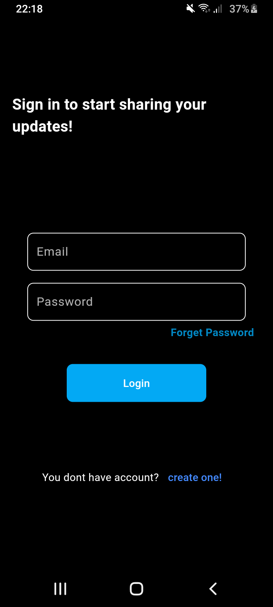
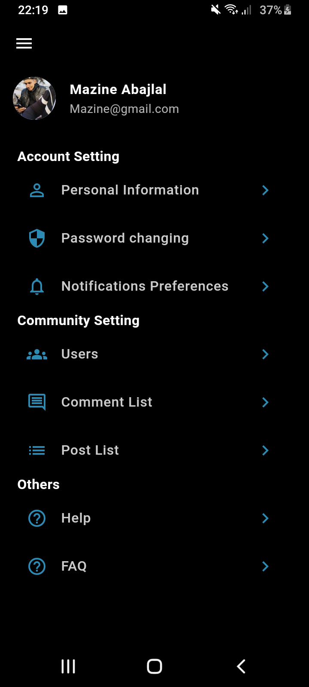
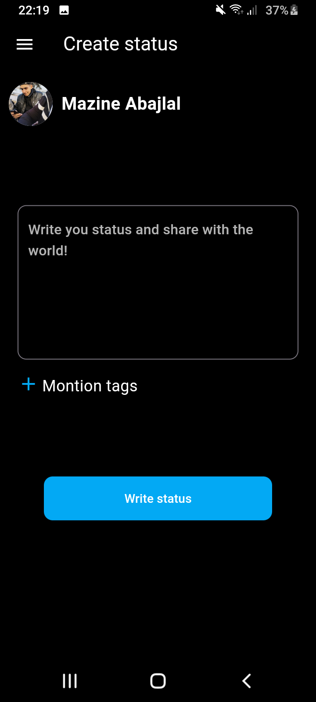
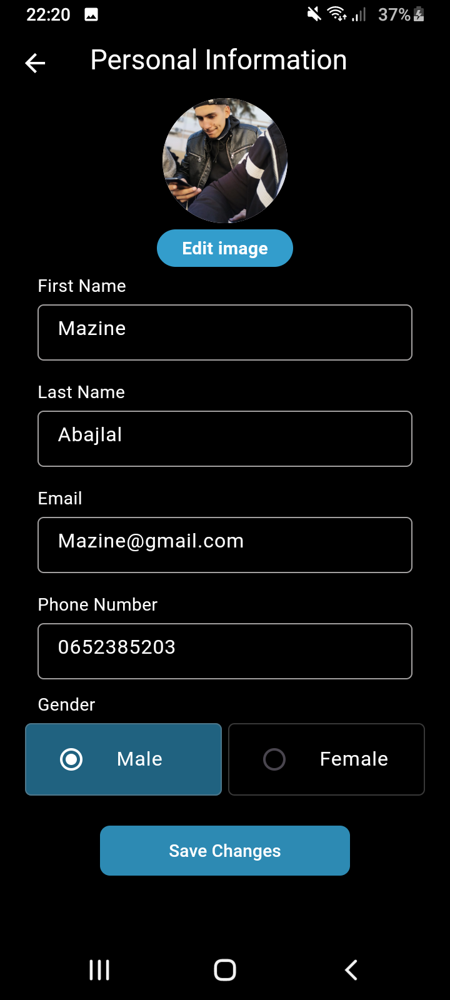

# echo

## 🚀 Key Features:
- Create an account, edit profile information, and reset your password.
- Create, edit, delete, and share statuses with other users.
- Browse other users' statuses, and react or comment on any status.
- View a list of your statuses and comments for easy editing and removal.
- View profiles of other users.
- Real-time application functionality.
- Enhanced user experience with dark mode support.

## :eyes: App Screenshots:
  

  
